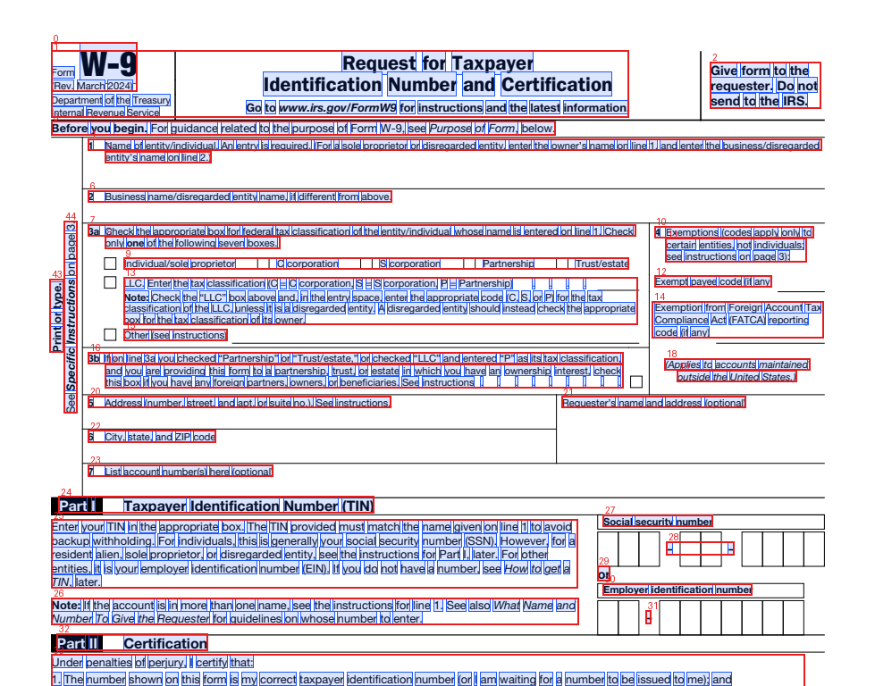

# pdfwords

[](https://github.com/dangquan1402/pdfwords/actions/workflows/ci.yml)
[](https://pdfwords.readthedocs.io/en/latest/)
[](https://pypi.org/project/pdfwords/)
[](https://pypi.org/project/pdfwords/)
[](LICENSE)

**PDF text extraction with character, word, line and block bounding boxes.** Its output matches
PyMuPDF's `page.get_text()`, it is built on [PDFium](https://pdfium.googlesource.com/pdfium/)
through [pypdfium2](https://github.com/pypdfium2-team/pypdfium2), and it is licensed
**Apache-2.0**. An optional Rust core makes it about as fast as PyMuPDF.

Documentation: **https://pdfwords.readthedocs.io** (guides plus the API reference).



## Why

`PyMuPDF.get_text("words" | "dict" | "rawdict")` is the de-facto API for "text + where it is on
the page". However, PyMuPDF/MuPDF is **AGPL-3.0**, which is a problem for closed-source,
on-device or commercial apps. pdfwords provides the same output shapes and coordinate
conventions:

* on a permissively licensed engine: PDFium is BSD-3/Apache-2.0, pypdfium2 is Apache-2.0/BSD-3;
* with a grouping algorithm written from scratch and its thresholds
  [derived from data](docs/THRESHOLDS.md);
* with a pure-Rust core (`crates/pdfwords-core`) that can be embedded in iOS/Android/desktop apps.

## Install

Prebuilt abi3 wheels (one per platform, any CPython ≥ 3.9) cover:

* Linux x86_64 and aarch64 (manylinux 2.28);
* macOS x86_64 and arm64;
* Windows x64.

They bundle the Rust backend. With [pip](https://pip.pypa.io) or [uv](https://docs.astral.sh/uv/):

```bash
pip install pdfwords                 # pip
uv add pdfwords                      # uv project (adds it to pyproject.toml + uv.lock)
uv pip install pdfwords              # uv, into the active virtualenv

pip install "pdfwords[edit,ocr]"     # extras (see below)
uv add "pdfwords[edit,ocr]"

uvx pdfwords file.pdf --mode text    # one-off CLI run, no install (uv tool run)
uv tool install pdfwords             # or keep the `pdfwords` command on PATH
```

> **PyPI status:** the first PyPI release (0.4.0) is waiting on the trusted-publisher setup.
> Until it appears on PyPI, install the tagged release from GitHub. This builds the Rust
> extension, so it needs a Rust toolchain:
> `pip install "pdfwords @ git+https://github.com/dangquan1402/pdfwords@v0.4.0"`,
> `uv add "pdfwords @ git+https://github.com/dangquan1402/pdfwords@v0.4.0"` or
> `uvx --from git+https://github.com/dangquan1402/pdfwords@v0.4.0 pdfwords --help`.

From a checkout (needs a Rust toolchain for the fast backend):

```bash
git clone https://github.com/dangquan1402/pdfwords && cd pdfwords
pip install .                        # or: uv pip install .   (builds the Rust extension with maturin)
uv sync --extra test && uv run pytest   # dev environment with uv (editable build)
# or, pure Python only (no Rust needed): put python/ on the path
PYTHONPATH=python python -c "import pdfwords; print(pdfwords.available_backends())"   # ['python']
```

The only runtime dependency is `pypdfium2`. The optional extras are:

| Extra | Adds | Licence |
|---|---|---|
| `edit` | content streams, redaction, text insertion: pypdf, fontTools, Pillow | BSD-3 / MIT / MIT-CMU |
| `render` | numpy, Pillow | BSD / MIT-CMU |
| `ocr` | pytesseract (plus the tesseract binary), numpy, Pillow | Apache-2.0 |
| `ocr-rapid` | RapidOCR | Apache-2.0 |
| `tables` | pandas | BSD-3 |
| `arrow` | pyarrow | Apache-2.0 |
| `langchain` | langchain-core | MIT |
| `llamaindex` | llama-index-core | MIT |
| `mcp` | the MCP SDK (Python ≥ 3.10) | MIT |
| `numpy` | numpy, for `Page.words_array()` | BSD |

Install any of them the same way: `pip install "pdfwords[tables,arrow]"` or
`uv add "pdfwords[tables,arrow]"`.

## Quick start

```python
import pdfwords

doc = pdfwords.open("file.pdf")          # like pymupdf.open
page = doc[0]

page.get_text("words")
# [(x0, y0, x1, y1, "word", block_no, line_no, word_no), ...]   PDF points, top-left origin

page.get_text("words", sort="xycut")     # column-aware reading order (also sort=True: y, x)

d = page.get_text("dict")                # {"width", "height", "blocks": [{"bbox", "lines": [{"bbox", "dir",
for b in d["blocks"]:                    #     "spans": [{"text", "font", "size", "flags", "color", "bbox", "origin"}]}]}]}
    for line in b["lines"]:
        for span in line["spans"]:
            print(span["bbox"], span["font"], span["size"], span["text"])

raw = page.get_text("rawdict")           # spans carry "chars": [{"c", "bbox", "origin", "synthetic"}]
page.get_text("blocks")                  # [(x0, y0, x1, y1, "text", block_no, 0), ...]
page.get_text("text")                    # plain text;  also "json" / "rawjson"

# options shared by all modes
page.get_text("words", clip=(0, 0, 300, 400), rotated=False, ligatures=False,
              dehyphenate=False, delimiters=None)

bboxes, ids, texts = page.words_array()  # numpy: float64 [N,4], int32 [N,3] (block, line, word), list[str]
pdfwords.parallel_words("big.pdf", processes=8)   # one process per worker (PDFium is single-threaded)
```

**Coordinates.** Coordinates are in PDF points with a top-left origin, relative to the CropBox
of the *unrotated* page, which is the same as PyMuPDF. Pass `rotated=True` to get coordinates
on the page as displayed. `page.rect` and `page.rotation` behave like PyMuPDF's.

**Span flags.** These use the PyMuPDF bit values: superscript 1, italic 2, serif 4,
monospaced 8, bold 16.

## Links, annotations, forms, quality, tables

```python
page.get_links()                # [{"kind": LINK_URI, "from": (x0, y0, x1, y1), "uri": "https://..."},
                                #  {"kind": LINK_GOTO, "from": ..., "page": 4, "to": (72.0, 92.0)}, ...]
page.get_links(web=True)        # + URLs written in the text without an annotation ({..., "auto": True})
page.get_text("dict", links=True)   # spans split at link boundaries, each with "url"
page.annots()                   # [{"type": "Highlight", "rect", "quads", "contents", "author", "stroke", ...}]
page.widgets()                  # form fields: field_name, field_type, field_value, checked, choices, rect
doc.get_toc()                   # [[level, title, page], ...]  (1-based, as PyMuPDF)
pdfwords.open("form.pdf", flatten=True)   # form values / annotation appearances become page text

page.text_quality()             # {"needs_ocr": False, "score": 1.0, "reasons": [], "invisible_ratio": 0.0,
                                #  "garbled_ratio": 0.0, "unicode_error_ratio": 0.0, "image_coverage": 0.0, "fonts": [...]}
page.needs_ocr();  doc.needs_ocr()        # True / list of page numbers without a usable text layer

page.search_for("hyphenation", quads=True, hit_max=10)   # matches across line breaks and line-end hyphens
page.table_cells(cell_boxes, image_size=(w, h))          # text of each cell box from a layout/table model

tabs = page.find_tables()       # ruled grids, booktabs-style and aligned tables (docs/TABLES.md)
tabs[0].extract(); tabs[0].to_markdown(); tabs[0].to_csv("t.csv"); tabs[0].to_pandas(); tabs[0].cells

# many pages: pages= and workers= on every mode, results streamed in page order
for pno, words in doc.iter_pages("words", pages=range(0, 500), workers=4):
    ...
pdfwords.extract(pdf_bytes, "dict", pages=[0, -1])          # path, bytes or file object
```

Drop-in replacement for [pdftext](https://github.com/datalab-to/pdftext) (same functions,
arguments and output schema, 2–15× faster; see [docs/PDFTEXT.md](docs/PDFTEXT.md)):

```python
from pdfwords.compat.pdftext import plain_text_output, dictionary_output, table_output
```

Visual debugging (needs Pillow):

```bash
pdfwords debug paper.pdf --page 3 --show words,lines,blocks,order,links -o p3.png
```

```python
from pdfwords.debug import overlay
overlay(page, show=("words", "blocks", "order")).save("p.png")   # chars words lines spans blocks order links annots widgets cells
```

## OCR fallback, RTL, vertical CJK, Arrow / Parquet

```python
page.get_text("words", ocr="auto")            # OCR only pages without a usable text layer (docs/OCR.md)
doc = pdfwords.open("scan.pdf", ocr={"mode": "auto", "engine": "tesseract", "lang": "eng"})
pdfwords.to_markdown(doc)                     # same schema everywhere: words, dict, markdown, chunks...

# Hebrew/Arabic in visual or logical order -> logical text (UAX #9-lite: numbers, mixed LTR/RTL,
# mirrored brackets); vertical Japanese/Chinese -> one line per column (wmode 1), right to left

doc.to_arrow("words")                         # pyarrow.Table, one row per char|span|line|word|block
doc.to_parquet("words.parquet", "chars")      # page, block, line, ..., x0, y0, x1, y1, text, font, size...
doc.to_pandas("lines", pages=[0, 1])
```

## Markdown, chunks and other LLM-ready output

```python
md = pdfwords.to_markdown("paper.pdf")            # headings, lists, tables, code, links; no running headers
for c in pdfwords.chunks("paper.pdf", max_chars=2000):
    c["text"], c["headings"], c["pages"], c["provenance"]   # provenance: [{"page", "bbox", "type"}]

page.get_text(sort="struct")                      # tagged PDFs: the author's reading order
page.get_text("dict", sort="struct", roles=True)  # blocks/spans with "role" (H1, P, LI, TD, ...)
page.get_struct_tree(); page.get_images(); page.get_drawings()
pdfwords.export("doc.pdf", "hocr", dpi=300)       # also html | xhtml | xml | alto | markdown
```

Optional extras add a LangChain loader (`pdfwords[langchain]`), a LlamaIndex reader
(`pdfwords[llamaindex]`) and an MCP server for LLM agents (`pdfwords[mcp]`, `pdfwords mcp`).
See [docs/LLM.md](docs/LLM.md).

## Rendering

Pages are rendered by PDFium, the same engine that extracts the text, so pixels and word boxes
line up exactly. There is no poppler and no new dependency: numpy is needed for arrays, and
Pillow for PIL or encoded output. See [docs/RENDERING.md](docs/RENDERING.md).

```python
img = page.render(dpi=150)                     # numpy (H, W, 3) RGB; grayscale=True, alpha=True, clip=...
img = page.render(max_side=1600, output="pil") # or size=(w, None), scale=2; output "png"/"jpeg"/"bytes"
px_box = page.bbox_to_pixel(word[:4], dpi=150) # word boxes -> pixels (pixel_to_pdf / pdf_to_pixel)
pix = page.get_pixmap(dpi=144)                 # PyMuPDF-style Pixmap shim
for (x, y), tile in page.render_tiles(dpi=600, tile=2048): ...
doc.to_images(dpi=150, workers=8, fmt="jpeg", out_dir="out/")   # files; iter_images() streams arrays
images = pdfwords.convert_from_path("f.pdf", dpi=200)           # pdf2image drop-in (pdfwords.compat.pdf2image)
```

* Sizes are `round(points × dpi / 72)`. pypdfium2's `render()` uses `ceil()`, which stretches
  US Letter to 1651 px at 150 dpi.
* `timeout=` aborts slow pages, and `max_pixels=` guards against huge pages.
* `forms=True` draws AcroForm values.

ms/page, whole documents, RGB numpy output (`tools/bench_render.py`):

| PDF | dpi | **pdfwords** | gray | pypdfium2 | PyMuPDF | pdf2image |
|---|---|---|---|---|---|---|
| arXiv "Attention" (15 p) | 150 | **18.9** | 16.0 | 19.2 | 22.4 | 74.9 |
| arXiv "ResNet" (12 p) | 150 | 10.7 | 7.9 | 11.5 | 9.7 | 59.3 |
| IRS W-9 form (6 p) | 150 | 10.2 | 7.4 | 9.6 | 7.2 | 36.3 |
| arXiv "Attention" (15 p) | 300 | **38.4** | 30.3 | 42.4 | 46.3 | 190.3 |
| arXiv "ResNet" (12 p) | 300 | 24.0 | 14.8 | 27.5 | 17.7 | 101.6 |

* pdfwords is 3–6× faster than pdf2image and level with PyMuPDF at ≤ 150 dpi.
* SSIM against PyMuPDF is 0.97–0.99.

## Editing: page content, redaction, text insertion

These are PyMuPDF-style methods (`pip install "pdfwords[edit]"` / `uv add "pdfwords[edit]"`). They use the same
coordinates as `get_text()`: top-left origin, unrotated page.

```python
doc = pdfwords.open("in.pdf")
page = doc[0]

page.read_contents()            # b"q 1 0 0 1 ... BT /F1 12 Tf ... ET Q"  (all content streams, decoded)
page.get_contents()             # [12, 13]  xrefs of the content streams
doc.xref_object(12)             # "<< /Length 1234 /Filter /FlateDecode >>"
doc.xref_stream(12)             # decoded stream bytes; also xref_stream_raw / update_stream / xref_length

# search + true redaction
for rect in page.search_for("Jane Doe"):          # also regex=True, quads=True
    page.add_redact_annot(rect, text="REDACTED", fill=(0, 0, 0), text_color=(1, 1, 1))
page.apply_redactions()         # images=PDF_REDACT_IMAGE_PIXELS, graphics=PDF_REDACT_LINE_ART_REMOVE_IF_COVERED
page.redaction_report           # {"glyphs_removed": 8, "images_blanked": 0, ..., "leftover_chars": [], "collateral_chars": []}
doc.scrub()                     # metadata, XMP, JavaScript, attachments, thumbnails, XFA

# text insertion
page.insert_text((72, 72), "Hello\nWorld", fontsize=12, fontname="helv", color=(1, 0, 0), rotate=0)
page.insert_text((72, 120), "Tiếng Việt có dấu", fontfile="DejaVuSans.ttf")   # embedded + subset, Unicode
rc = page.insert_textbox((72, 150, 300, 250), long_text, fontsize=10, align=3)  # 0 left 1 center 2 right 3 justify
# rc >= 0: unused height;  rc < 0: did not fit, nothing written (as in PyMuPDF)

doc.save("out.pdf", garbage=3, deflate=True)       # incremental=True allowed unless redacted/scrubbed
```

**Redaction removes content. It does not just paint over it.** `apply_redactions()` rewrites
the page's content streams. Every glyph under a redaction rectangle is deleted from its
`Tj`/`TJ` string and replaced by the equivalent `TJ` displacement, so the remaining glyphs
keep their exact positions. Form XObjects that are hit are copied and rewritten, so shared
forms on other pages stay intact. Image pixels under the area are overwritten, or the image
is removed. Vector art inside the area is removed, and so are annotations and form fields
that overlap it. `/ActualText` around removed glyphs and the document's XFA packets are
dropped. After rewriting, the page is re-extracted with PDFium:

* any character still mostly inside an area raises `RedactionError`;
* any character outside the areas that moved or vanished raises a `RedactionWarning`.

Saving always rewrites the file and garbage-collects the old streams. See
[docs/EDITING.md](docs/EDITING.md) for the method, guarantees and limits.

## CLI

```bash
pdfwords file.pdf --mode words --sort xycut --pages 0,2-4 -o words.json
pdfwords file.pdf --mode text
pdfwords file.pdf --mode rawdict --rotated --backend python

pdfwords redact in.pdf -o out.pdf --search "Jane Doe" --search "555-0100" --rect 72,700,300,720 \
    --fill 0,0,0 --text REDACTED --images pixels --graphics covered --scrub
pdfwords insert-text in.pdf -o out.pdf --page 0 --point 72,72 --text "Approved\nQ. Dang" --fontname hebo
pdfwords insert-text in.pdf -o out.pdf --rect 72,100,300,200 --align justify --text "..." --fontfile font.ttf
pdfwords contents in.pdf --pages 0      # decoded content streams

pdfwords file.pdf --mode dict --links --workers 4 --flatten      # span urls, process pool, form values
pdfwords debug file.pdf -p 0 --show words,blocks,order -o p0.png
pdfwords links file.pdf | pdfwords annots file.pdf | pdfwords toc file.pdf
pdfwords quality file.pdf               # {"needs_ocr": [pages...], "pages": [reports...]}
pdfwords search file.pdf "net income" --quads
pdfwords pdftext file.pdf [--json] [--sort] [--keep_hyphens] [--page_range 0,5-10] [--workers N] ...
pdfwords render file.pdf --pages 0,2-4 --dpi 150 --fmt jpeg --out-dir out/ --workers 8   # --gray --alpha --clip ...
pdfwords render file.pdf --pages 0 --overlay words,blocks -o debug.png
pdfwords export file.pdf -f markdown -o file.md      # html | xhtml | xml | hocr | alto
pdfwords chunks file.pdf --max-chars 1500 > chunks.jsonl
pdfwords objects file.pdf --kind images|drawings|struct
pdfwords mcp --root ~/Documents                      # MCP server (stdio)
pdfwords tables file.pdf --pages 3 -f md             # json | markdown | csv (-o dir/)
pdfwords frame file.pdf -o words.parquet --kind words   # or chars|spans|lines|blocks, or -o x.csv
pdfwords scan.pdf --mode text --ocr auto --ocr-engine tesseract --ocr-lang eng
```

## Backends

| backend | when | speed |
|---|---|---|
| `rust` | default when the compiled extension `pdfwords._native` is present (all wheels) | ≈ PyMuPDF |
| `python` | automatic fallback; pure Python + pypdfium2 ctypes | 3–11× slower |

You can select one with `pdfwords.open(path, backend="python")`, `$PDFWORDS_BACKEND`, or
`--backend` on the CLI. Both backends produce **identical** output, which `tests/test_parity.py`
asserts with `==` on every mode and option.

The Rust backend binds to the same PDFium library that pypdfium2 has loaded: it is located with
`dladdr` / `GetModuleHandleEx`. Override it with `PDFWORDS_PDFIUM_LIB=/path/to/libpdfium.so`.

## Benchmarks

The numbers below are ms per page, best of 5, for a whole document including open, on Linux
x86-64 (CPython 3.13, pypdfium2 5.10 / PDFium 151, PyMuPDF 1.28.2, pdftext 0.7.1). They come
from `benchmarks/bench_backends.py`; raw output is in `benchmarks/results/bench_backends.json`.

| PDF | pages | **pdfwords rust** words | rust rawdict | pdfwords python words | PyMuPDF words | PyMuPDF rawdict | pdftext |
|---|---|---|---|---|---|---|---|
| arXiv "Attention" | 15 | **5.93** | 7.47 | 17.39 | 5.18 | 15.61 | 28.60 |
| arXiv "ResNet" (2-col) | 12 | **3.96** | 6.89 | 25.95 | 4.43 | 8.08 | 39.39 |
| IRS W-9 (form) | 6 | **2.86** | 6.54 | 32.86 | 3.26 | 7.04 | 41.92 |
| camelot table | 1 | **3.23** | 4.62 | 16.90 | 3.87 | 5.19 | 20.56 |
| simple text | 2 | **1.18** | 1.84 | 5.97 | 1.55 | 1.91 | 7.88 |

About 75–85% of the Rust time is PDFium itself (`FPDF_LoadPage` + `FPDFText_LoadPage`).
pdfwords' own grouping and Python object creation cost about 0.4 ms per page.

Against other libraries (pdftext, PyMuPDF, pdfplumber, pdf_oxide, raw pypdfium2), including
word F1 and reading order on held-out synthetic ground truth, see
[docs/BENCHMARKS.md](docs/BENCHMARKS.md) (`tools/bench_suite.py`).

## Accuracy vs PyMuPDF

`benchmarks/compare_pymupdf.py` compares pdfwords with PyMuPDF on 6 documents (37 pages,
22,907 PyMuPDF words). PyMuPDF is used only as a black-box reference.

| PDF | word recall | median word-bbox IoU | same-line agreement | same-block agreement |
|---|---|---|---|---|
| arxiv_attention | 0.9962 | 1.0 | 0.9997 | 0.9988 |
| arxiv_resnet | 0.9994 | 1.0 | 0.9988 | 0.9982 |
| irs_w9 | 0.9978 | 1.0 | 1.0 | 0.9970 |
| table_camelot | 1.0 | 1.0 | 0.9976 | 0.9953 |
| simple_text | 1.0 | 1.0 | 1.0 | 1.0 |
| rot90 | 1.0 | 0.85* | 1.0 | 1.0 |

**Weighted word recall: 99.81%.** \*rot90 uses a non-embedded base-14 font, and PDFium's
substitute font metrics make the boxes slightly taller; x positions are identical.

On our synthetic ground-truth set (`tests/fixtures/synthetic.*`), word F1, line agreement and
superscript detection are all 1.0, and block agreement is 0.996. See
[docs/THRESHOLDS.md](docs/THRESHOLDS.md).

## Limitations

* **OCR is optional and engine-bound.** `ocr="auto"` needs an engine installed (Tesseract,
  RapidOCR or Apple Vision); OCR char boxes are evenly split inside each word.
* **Bidi is UAX #9-lite**: numbers, neutrals, mixed-direction lines and bracket mirroring,
  but no explicit embeddings/isolates (LRE/RLI...). **Vertical CJK** is detected for
  unrotated text drawn glyph by glyph down a column (Identity-V fonts); rotated vertical
  layouts and mixed tate-chu-yoko are not.
* **Table detection is heuristic** (docs/TABLES.md): spanning cells in unruled tables are
  split, multi-line cells in unruled tables become rows, form boxes can look like tables.
* **Ligatures** come out decomposed by default ("fi"), because PDFium does not expose the
  original code point. `ligatures=True` re-composes U+FB00–FB06.
* **Text blocks only** in `get_text("dict")`: images and vector paths are available separately
  (`get_images()`, `get_drawings()`); there is no underline/strike-out detection yet.
* **Markdown is heuristic** for untagged PDFs (headings from the outline and font statistics).
* **PDFium is not thread-safe.** Do not call pdfwords or pypdfium2 from several threads at once.
  The Rust backend holds the GIL for each call. Use processes for parallelism
  (`workers=` on `doc.extract()` / `iter_pages()`).
* **Base-14 metrics.** Boxes of non-embedded base-14 fonts follow PDFium's substitute metrics,
  which differ slightly from PyMuPDF's.
* **Editing** has no text shaping: complex scripts that need GSUB/GPOS shaping (Arabic,
  Devanagari, ...) are not supported. Precomposed Latin, including Vietnamese, works. For other
  redaction limits see [docs/EDITING.md](docs/EDITING.md#limits).

## Roadmap

* **iOS / Android via `pdfwords-core`.** The pure-Rust crate already does the whole pipeline.
  Next steps:
  * a uniffi or C ABI layer, giving an xcframework (with PDFium iOS binaries) and an Android AAR
    built with `cargo ndk`;
  * static linking of PDFium.
* Publish `pdfwords-core` to crates.io.
* WebAssembly build of the Rust core (feasible; see [docs/WASM.md](docs/WASM.md)).

See [docs/DESIGN.md](docs/DESIGN.md) for the architecture.

## Development

```bash
# with uv: one command builds the Rust extension (editable) and installs the test deps
uv sync --extra test
uv run python tools/fetch_test_pdfs.py        # optional: download public test PDFs
uv run pytest                                 # both backends + parity + accuracy

# or with pip
python -m venv .venv && . .venv/bin/activate
pip install maturin pytest numpy pymupdf      # pymupdf: optional, accuracy tests only
maturin develop --release                     # builds the Rust extension into python/pdfwords
pytest
cargo test --workspace && cargo clippy --workspace --all-targets -- -D warnings && cargo fmt --check
```

See [CONTRIBUTING.md](CONTRIBUTING.md).

## Acknowledgements

* The output format and API are designed to be **compatible with PyMuPDF's** `Page.get_text()`,
  so that existing code can switch easily. pdfwords is an independent project, **not affiliated
  with or endorsed by Artifex or the PyMuPDF project**, and it contains no MuPDF/PyMuPDF code.
  PyMuPDF is used only as an optional, black-box reference in tests and benchmarks.
* `pdfwords.compat.pdftext` follows the public API and output schema of
  [pdftext](https://github.com/datalab-to/pdftext) (Apache-2.0) so it can be swapped in; it is
  an independent implementation.
* Text extraction is powered by [PDFium](https://pdfium.googlesource.com/pdfium/) and
  [pypdfium2](https://github.com/pypdfium2-team/pypdfium2). See [NOTICE](NOTICE).

## License

Apache-2.0. See [LICENSE](LICENSE) and [NOTICE](NOTICE).
